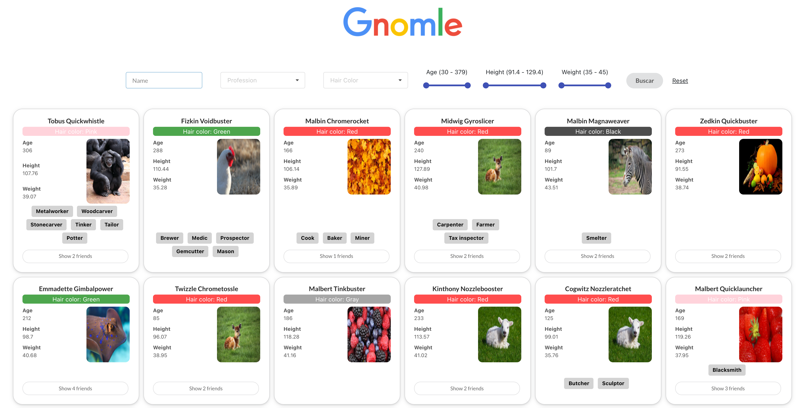
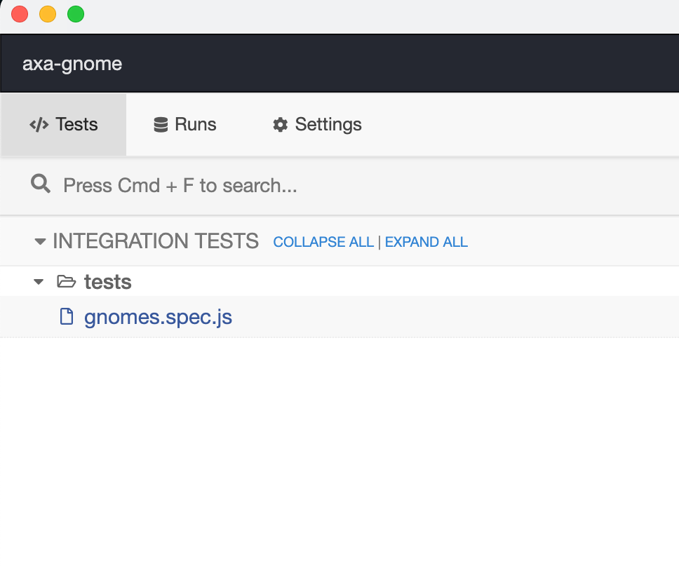

# GNOMLE - Your easy and user friendly Gnome finder for Brastlewark life.

Don't get lost in Brastlewark!. With our app, finding the Gnome you are looking for is easier than ever before!
Look for them by name, hair color, height and many more. you can even have a quick preview of a Gnome's friend.

##

<div>
  
</div>

## Installation

##### Clone this repository

```bash
  git clone https://github.com/francisco-jimenez/axa-gnomes
  cd axa-gnomes
```

##### Install & Start, you are ready to go!:

```bash
npm install
npm start
```

## Testing

This project includes a E2E testing solution based on: [Cypress](https://www.cypress.io/),

#### Caption!! You need to have your app started in order to run the tests.

By executing this command:

```bash
    npm run cypress:open
```

A test suite will be open as a external window, click on 'gnomes.spec.js'

  <div>
     
  </div>

Then, a instance of Google Chrome will appear simulating interactions with the app and checking everuthing behaves as expected.

## Tech Stack

Tried to keep it as simple as possible, hate over-engineering.

React
Typescript
Cypress
[Semantic UI](https://react.semantic-ui.com/)

## Author

[Curro Jimenez](https://www.linkedin.com/in/franciscojimenez87/)
